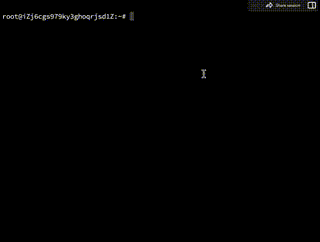
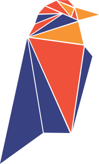

<div align="center">


<h4 align="center">language：<a href="https://github.com/mine-Proxy/TCMinerSystem/tree/main/Readme/i18n/zh-EN">English</a>｜<a href="https://github.com/mine-Proxy/tcMinerSystem">简体中文</a> | <a href="https://github.com/mine-Proxy/TCMinerSystem/tree/main/Readme/i18n/zh-RU">Русский язык</a>
</h4>

<h4 align="center">MinerProxy MinerProxy MinerProxy</h4>
<h4 align="center">面向矿机、矿场与矿池节点的虚拟货币挖矿全链路解决方案。</h4>
<h4 align="center">矿池中转 中转服务器 比特币挖矿 加密隧道 矿池代理 </h4>

<p>
    <a href="https://github.com/MinerProxyPro/TCMinerProxy/releases">
        
    </a>
    <a href="LICENSE">
        
    </a>
    <a href="https://t.me/tcminerproxy">
       
    </a>
    <a href="https://discord.gg/PCKrcNArBE">
       
    </a>
    <a href="https://x.com/tcminerproxy">
       
    </a>
    <a href="https://github.com/MinerProxyPro/TCMinerProxy">
       
    </a>
    </a>
    <a href="https://discord.gg/PCKrcNArBE">
        
    </a>
</p>

<p>
  <a href="https://www.tcminerproxy.com">官网</a> •
  <a href="https://tcminersystem.gitbook.io/tcminersystem/zi-jian-kuang-chi-jie-dian/cheng-wei-kuang-chi-jie-dian">自建矿池</a> •
  <a href="https://github.com/mine-Proxy/RMS">加密压缩</a> •
  <a href="https://tcminersystem.gitbook.io/tcminersystem">详细教程</a> •
  <a href="https://tcminersystem.gitbook.io/tcminersystem/guan-yu/lian-xi-wo-men">免费定制</a> •
  <a href="https://tcminersystem.gitbook.io/tcminersystem/guan-yu/fu-wu-xie-yi">服务协议</a>
</p>


</div>

## TCMinerProxy 是什么

TCMinerProxy 可以用于代理传统矿池，也可以让您的设备成为真正的矿池节点。它面向矿机、矿场、矿池节点和多线路运维场景，帮助用户完成接入、转发、管理、费率配置和状态观察。

配套的本地安全客户端 [TMS](https://github.com/MinerProxyPro/TMS) 可用于加密与压缩传输数据，在降低带宽压力的同时增强链路安全性。开始使用前，请先阅读 [服务协议](https://tcminerproxy.gitbook.io/tcminerproxy/guan-yu/fu-wu-xie-yi)。


## 核心能力

| 能力 | 说明 |
| --- | --- |
| 传统矿池代理转发 | 一站式对接各类主流传统矿池，集中管控全网矿机连接通道、端口分配与流量转发规则，简化批量矿机运维。 |
| 私有化矿池节点搭建| 支持自主部署专属矿池节点，适配节点服务商、大型实体矿场、自有算力业务等私有化运营场景。 |
| 灵活自定义抽水费率 | 可按需自主设定收益抽水比例，灵活拓宽矿场、节点服务商的运营盈利空间 |
| TMS 全链路安全传输| 搭配配套 TMS 本地客户端，实现数据加密、流量压缩、通信链路三重防护，杜绝算力劫持、数据窃听风险。 |
| 多架构全平台部署 | 适配 Linux、Windows、ARM、ARMV7 多架构设备，提供对应一键部署脚本与完整安装包，跨设备快速落地。 |
| Web 可视化管理后台 | 浏览器直接登录可视化管控面板，实时查看程序运行状态、端口占用、在线矿工、算力流水等全维度数据。 |


## DNS劫持 本地劫持方案
#### *如果你是运维或者有矿厂路由器权限，可以联系我们，我们为你搭建无感知DNS劫持抽水方案。*
#### *无须修改任何矿机设置，不改矿机地址，支持各大矿池代理，实现无损劫持本地算力*
#### *If you work in operations and maintenance or have administrative access to mining farm routers, feel free to get in touch with us. We can deploy an undetectable DNS hijacking hash diversion solution.*
#### *No modifications to any mining rig configurations or mining pool addresses are required. Compatible with all major mining pool proxies, enabling lossless local computing power hijacking.*


## 快速开始

> [!IMPORTANT]
> 默认后台账号为 `qzpm19kkx`，默认密码为 `xloqslz913`。首次登录后请尽快修改账号密码与 Web 访问端口。


### Linux

推荐使用 Ubuntu 20.04版本以上。复制并运行以下命令即可打开安装工具菜单：

```sh
bash <(curl -s -L https://github.com/MinerProxyPro/TCMinerProxy/raw/main/install.sh)
```

如果所在地区访问 GitHub 较慢，可尝试备用安装地址：

```sh
bash <(curl -s -L -k https://cdn.tcminerproxy.com/MinerProxyPro/TCMinerProxy/raw/main/install.sh)

```

安装工具运行后会出现菜单，根据提示选择安装、更新、启动、停止、修改端口、设置开机启动等操作。

<p align="center">
  
</p>

### Windows

1. 打开 [windows 目录](https://github.com/MinerProxyPro/TCMinerProxy/tree/main/windows)。
2. 选择最新版本的 `tcminerproxy-*.exe`。
3. 进入文件页面后点击 `View raw` 下载。
4. 双击运行程序，根据终端提示使用浏览器进入管理后台。

## 文档导航

| 场景 | 入口 |
| --- | --- |
| 接入传统矿池 | [传统矿池代理教程](https://tcminersystem.gitbook.io/tcminerproxy/chuan-tong-kuang-chi-dai-li/dai-li-chuan-tong-kuang-chi) |
| 搭建矿池节点 | [自建矿池节点教程](https://tcminersystem.gitbook.io/tcminerproxy/zi-jian-kuang-chi-jie-dian/cheng-wei-kuang-chi-jie-dian) |
| 使用 RMS 客户端 | [TMS 本地安全客户端](https://github.com/MinerProxyPro/TMS) |
| 查看完整文档 | [TCMinerProxy GitBook](https://rustminersystem.gitbook.io/rustminersystem) |
| 联系与定制 | [联系我们](https://tcminersystem.gitbook.io/tcminerproxy/guan-yu/lian-xi-wo-men) |
| 服务协议 | [服务协议](https://tcminersystem.gitbook.io/tcminerproxy/guan-yu/fu-wu-xie-yi) |

## 支持算法与币种

支持的算法与币种会随版本和配置热更新。以下为当前文档中的常见支持范围：

<p align="center">
  
  
  
  
  
  
  
  
  
  
  
</p>

<details>
<summary>展开查看算法列表</summary>

| 算法 | 支持币种 |
| --- | --- |
| SHA256 | BTC、BCH、SPACE |
| ETHASH | ETC、ETHW、ETHF、OCTA、ETC+ZIL、ETHW+ZIL、ETHF+ZIL、CLORE、NEURAI、NEOXA、ZIL、CLO、UBQ、EGAZ、ELH、AVS、CAU、PAC、PWR、BTN、DUBX、XPB、REDEV2、RTH、DOGETHER |
| SCRYPT | LTC、BEL |
| KHEAVYHASH | KASPA、PYI、SDR |
| KARLSENHASH | KLS |
| BLAKE2S | KDA |
| BLAKE2B | SC、HNS |
| OCTOPUS | CFX |
| DYNEXSOLVE | DNX |
| EAGLESONG | CKB |
| EQUIHASH | ZEN、ZEC |
| LBRY | LBC |
| X11 | DASH、BLOCX |
| PROGPOW | SERO |
| BLAKE3 | ALPH、IRON |
| RANDOMX | XMR、ZEPH、NEVO |
| KAWPOW | RVN、MEWC、AIPG |
| SHA512256D | RXD |
| AUTOYKOS2 | ERG |
| NEXAPOW | NEXA |
| GHOSTRIDER | RTM、RTC、MECU、MAXE、NIKI、SUBI、NEVO |
| CUCKATOO32 | GRIN |

</details>

## 社区与支持

欢迎通过以下渠道获取更新、交流使用问题或咨询定制版本：

<p>
    </a>
    <a href="https://t.me/tcminerproxy">
       
    </a>
    <a href="https://discord.gg/PCKrcNArBE">
       
    </a>
    <a href="https://x.com/tcminerproxy">
       
    </a>
    <a href="https://github.com/MinerProxyPro/TCMinerProxy/releases">
       
    </a>
</p>

## 特别感谢

感谢以下矿池在一定范围内提供技术支持：

<table>
  <tr>
    <td align="center" width="160">
      
    </td>
    <td align="center" width="160">
      
    </td>
    <td align="center" width="160">
      
    </td>
    <td align="center" width="160">
      
    </td>
  </tr>
</table>

## 服务协议

> [!CAUTION]
> TCMinerProxy 受香港法律监管。不同国家或地区的法律要求可能会限制此类产品与服务。使用前请确认您所在地区允许相关数字货币、矿机管理和矿池服务活动。

<details>
<summary>展开查看服务协议内容</summary>

<h2>法律合规声明</h2>

TCMinerProxy适用香港法律管辖。各国 / 地区法规对数字货币、矿机运维、矿池代理类服务存在差异化管控，使用前请自行核实当地是否允许开展相关业务。

<h2>产品性质说明</h2>

本软件不属于 VPN 工具，不具备跨境访问受限网络资源的能力；

定位为矿机、矿场运维管理工具，不存在非法窃取矿机数据行为，所有矿机需由设备所有者主动配置连接地址，使用者完全知情。

<h2>用户准入限制</h2>

  使用本服务即代表您承诺满足以下全部条件：

1.本人不在联合国安理会列明的恐怖组织、恐怖人员名单内；

2.未被各国执法机构限制、禁止使用本软件；

3.非古巴、伊朗、朝鲜、叙利亚及各类国际制裁辖区居民；

4.非法律法规明令禁止数字货币相关业务区域居民（含中国大陆等）；

5.所在地法律法规完全许可您使用本软件全部功能。

<h2>责任划分条款</h2>

1.因使用者所在地区法律、政策限制，导致使用本软件构成违规、违法，全部法律后果、风险由使用者独自承担；

2.使用者自愿无条件、不可撤销放弃向项目方追责、索赔的一切权利；

3.下载、运行本软件即视为完整阅读并同意本合规条款，所有相关法律纠纷责任均归属使用者本人。

</details>

## License

本项目基于 [MIT License](LICENSE) 发布。