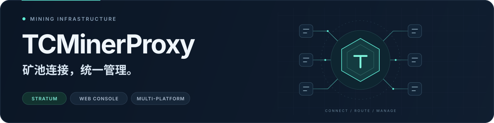

<div align="center">

<p></p>

<h1>TCMinerProxy — MinerProxy 矿池代理</h1>

<p><strong>矿池中转 · 算力管理 · TMS 加密传输</strong></p>

<p>
  <strong>简体中文</strong> &nbsp; / &nbsp;
  <a href="Readme/i18n/zh-EN/README.md">English</a> &nbsp; / &nbsp;
  <a href="Readme/i18n/zh-RU/README.md">Русский</a>
</p>

<p>
  <a href="https://github.com/MinerProxyPro/TCMinerProxy/releases"></a>
  <a href="LICENSE"></a>
  
  <a href="https://t.me/tcminerproxy"></a>
  <a href="https://discord.gg/PCKrcNArBE"></a>
  <a href="https://x.com/tcminerproxy"></a>
  <a href="https://github.com/MinerProxyPro/TCMinerProxy"></a>
</p>

<p>
  <a href="#下载与安装"><strong>下载与安装 →</strong></a> &nbsp; · &nbsp;
  <a href="https://www.tcminerproxy.com/zh/document/tcminerproxy/quick-start">矿池接入教程</a> &nbsp; · &nbsp;
  <a href="https://www.tcminerproxy.com">访问官网</a> &nbsp; · &nbsp;
  <a href="https://www.tcminerproxy.com/zh/customized-version">免费定制</a>
</p>

</div>

**TCMinerProxy 是面向矿机与矿场的 MinerProxy 矿池代理与中转工具。** 通过 Web 后台统一管理矿机连接、代理端口、自定义抽水费率和算力状态，支持 Linux、Windows 部署。需要加密与压缩传输时，可搭配 TMS 本地客户端。

本仓库提供 **TCMinerProxy 下载、安装说明、支持算法列表与使用文档入口**。首次部署可从[下载与安装](#下载与安装)开始，选型前可先了解[组件区别](#部署方式)与[软件费率](#费用与抽水说明)。

---

<p align="center">
  <a href="#核心能力">核心能力</a> &nbsp; / &nbsp;
  <a href="#部署方式">部署方式</a> &nbsp; / &nbsp;
  <a href="#下载与安装">下载安装</a> &nbsp; / &nbsp;
  <a href="#支持算法与币种">支持币种</a> &nbsp; / &nbsp;
  <a href="#费用与抽水说明">费用说明</a> &nbsp; / &nbsp;
  <a href="#常见问题">常见问题</a>
</p>

## 核心能力

围绕矿池连接、流量转发与日常运维，按部署场景使用服务端和 TMS 本地客户端。

<table>
  <tr>
    <td width="50%" valign="top">
      <sub>01 / PROXY</sub>
      <h3>矿池代理与中转</h3>
      <p>对接主流传统矿池，集中管理矿机连接、端口分配与流量转发规则。</p>
    </td>
    <td width="50%" valign="top">
      <sub>02 / FORWARDING</sub>
      <h3>透明转发</h3>
      <p>TP 模式专注连接转发，不做币种解析、统计与费率处理。</p>
    </td>
  </tr>
  <tr>
    <td width="50%" valign="top">
      <sub>03 / FEE CONTROL</sub>
      <h3>自定义抽水费率</h3>
      <p>按需设置抽水比例，为不同运营场景配置相应的费率。</p>
    </td>
    <td width="50%" valign="top">
      <sub>04 / TMS TRANSPORT</sub>
      <h3>加密与压缩传输</h3>
      <p>配合 TMS 本地客户端增强链路安全，并降低数据传输的带宽压力。</p>
    </td>
  </tr>
  <tr>
    <td width="50%" valign="top">
      <sub>05 / DEPLOYMENT</sub>
      <h3>多平台部署</h3>
      <p>支持 Linux、Windows 及 ARM、ARMV7 架构设备，提供安装脚本与程序包。</p>
    </td>
    <td width="50%" valign="top">
      <sub>06 / WEB CONSOLE</sub>
      <h3>可视化管理</h3>
      <p>通过浏览器查看运行状态、端口、在线矿工与算力数据。</p>
    </td>
  </tr>
</table>

## 管理后台预览

<p align="center">
  
</p>
<p align="center"><sub>Web 管理后台 · 矿机接入、运行状态与算力观察</sub></p>

## 部署方式

| 你的需求 | 使用组件 | 部署位置与作用 |
| :--- | :--- | :--- |
| 接入已有第三方矿池 | **TCMinerProxy 服务端** | 部署在代理服务器或矿场网关，负责端口、矿机连接、费率钱包与统计。 |
| 加密压缩矿场接入链路 | **TCMinerProxy + TMS** | TMS 部署在矿场局域网，汇聚本地矿机连接后接入服务端。 |

普通矿池代理链路：

```text
矿机 → TCMinerProxy 服务端 → 第三方矿池
```

使用 TMS 的链路：

```text
矿机 → 矿场本地 TMS → TCMinerProxy 服务端 → 第三方矿池
```

对应配置说明：[TCMinerProxy 服务端文档](https://www.tcminerproxy.com/zh/document/tcminerproxy) · [TMS 加密压缩接入](https://www.tcminerproxy.com/zh/document/tms)。

## 下载与安装

| 部署方式 | 适用环境 | 安装入口 |
| :--- | :--- | :--- |
| **Linux** | 推荐 Ubuntu 20.04 及以上版本 | [Linux 安装步骤](#linux-安装) · [Linux 程序目录](https://github.com/MinerProxyPro/TCMinerProxy/tree/main/linux) |
| **Windows** | Windows 设备 | [Windows 安装步骤](#windows-安装) · [Windows 程序目录](https://github.com/MinerProxyPro/TCMinerProxy/tree/main/windows) |
| **TMS 客户端** | 需要加密、压缩传输的链路 | [TMS 项目与使用说明](https://github.com/MinerProxyPro/TMS) |

查看[版本标签](https://github.com/MinerProxyPro/TCMinerProxy/tags)与[服务端官方下载页](https://www.tcminerproxy.com/zh/download/tcminerproxy-core-server)，选择适合当前环境的程序。版本与文件名以官方发布内容为准。

> [!IMPORTANT]
> 默认后台账号：`qzpm19kkx` · 默认密码：`xloqslz913`。<br>
> 首次登录后请修改账号、密码与 Web 访问端口，设置安全访问地址并开启二步验证。如果安装流程已提示自定义账号密码，以实际提示为准。使用前请阅读[服务协议](#服务协议)。

### Linux 安装

**1. 打开安装工具**

使用 root 权限，在已安装 curl 的 Bash 终端中运行：

```sh
bash <(curl -s -L https://github.com/MinerProxyPro/TCMinerProxy/raw/main/install.sh)
```

**备用安装地址（GitHub 访问较慢时使用）**

```sh
bash <(curl -s -L -k https://cdn.tcminerproxy.com/MinerProxyPro/TCMinerProxy/raw/main/install.sh)
```

**2. 按菜单提示安装**

安装工具支持安装、更新、启动、停止、修改端口与设置开机启动等操作。

<details>
<summary>查看安装菜单演示</summary>

<p align="center">
  
</p>

</details>

**3. 进入管理后台**

根据终端提示，在浏览器中打开后台地址，登录后完成账号与端口设置。手动部署与启动验证请参考 [Linux 与 Windows 安装教程](https://www.tcminerproxy.com/zh/document/tcminerproxy/installation)。

### Windows 安装

1. 打开 [Windows 下载目录](https://github.com/MinerProxyPro/TCMinerProxy/tree/main/windows)，选择最新版本的 `TCMinerProxy-*.exe`。
2. 进入文件页面，点击 **View raw** 下载。
3. 双击运行程序，根据终端提示在浏览器中打开管理后台。
4. 使用默认账号登录，并修改账号、密码与 Web 访问端口。

### 首次连接矿机

建议先使用 **1–5 台测试矿机** 验证完整连接流程，再扩大接入规模。

1. 准备上游矿池地址、协议、钱包或子账号，以及矿工名。
2. 在后台进入 **矿池代理 → 创建新代理**，填写监听协议、监听端口和代理币种。
3. 配置主矿池地址与协议，按需配置备用矿池和费率钱包；确认矿机能访问监听端口，服务端能访问上游矿池。
4. 保存配置，等待端口状态正常，再将测试矿机连接到服务端的监听地址。
5. 在后台检查在线设备、算力与连接日志，并在上游矿池核对矿工数据。

例如，使用 TCP 监听端口时，矿机连接地址的格式为：

```text
stratum+tcp://你的服务器IP:监听端口
```

协议选择与详细配置请参考[矿池中转快速开始](https://www.tcminerproxy.com/zh/document/tcminerproxy/quick-start)和[创建代理端口教程](https://www.tcminerproxy.com/zh/document/tcminerproxy/proxy-port)。

## 支持算法与币种

<p>
   &nbsp;
   &nbsp;
   &nbsp;
   &nbsp;
   &nbsp;
   &nbsp;
   &nbsp;
   &nbsp;
   &nbsp;
   &nbsp;
  
</p>

项目文档列出了 BTC、BCH、LTC、ETC、ETHW、KASPA 等币种及对应算法。**算法支持与具体矿机、矿池的兼容性需要分别确认**；实际支持情况以所用版本、矿机协议与矿池要求为准。

<details>
<summary><strong>展开完整算法与币种列表</strong></summary>

| 算法 | 支持币种 |
| :--- | :--- |
| SHA256 | BTC、BCH、SPACE |
| ETHASH | ETC、ETHW、ETHF、OCTA、ETC+ZIL、ETHW+ZIL、ETHF+ZIL、CLORE、NEURAI、NEOXA、ZIL、CLO、UBQ、EGAZ、ELH、AVS、CAU、PAC、PWR、BTN、DUBX、XPB、REDEV2、RTH、DOGETHER |
| SCRYPT | LTC、BEL |
| KHEAVYHASH | KASPA、PYI、SDR |
| KARLSENHASH | KLS |
| BLAKE2S | KDA |
| BLAKE2B | SC、HNS |
| OCTOPUS | CFX |
| DYNEXSOLVE | DNX |
| EAGLESONG | CKB |
| EQUIHASH | ZEN、ZEC |
| LBRY | LBC |
| X11 | DASH、BLOCX |
| PROGPOW | SERO |
| BLAKE3 | ALPH、IRON |
| RANDOMX | XMR、ZEPH、NEVO |
| KAWPOW | RVN、MEWC、AIPG |
| SHA512256D | RXD |
| AUTOYKOS2 | ERG |
| NEXAPOW | NEXA |
| GHOSTRIDER | RTM、RTC、MECU、MAXE、NIKI、SUBI、NEVO |
| CUCKATOO32 | GRIN |

</details>

## 费用与抽水说明

软件服务费率与运营者配置的抽水比例应分别了解：

| 费用项目 | 公开说明 | 适用场景 |
| :--- | :--- | :--- |
| **传统矿池代理软件费率** | **0.2%**，按接入算力收取 | 第三方矿池 Proxy 场景。 |
| **自定义抽水比例** | 由运营者按需配置 | 通过费率钱包、矿工名、比例和目标矿池配置抽水策略。 |

软件费率依据[官网费用说明](https://www.tcminerproxy.com/zh/about)整理（2026-10-08）。具体执行规则请结合当前版本后台、发布说明与服务协议确认；运营者设置的抽水比例不能替代对软件费率的确认。

## 常见问题

### TCMinerProxy 与 TMS 有什么区别？

TCMinerProxy 是服务端，负责矿池代理、端口配置、费率钱包和运行统计；TMS 是矿场本地客户端，负责汇聚矿机连接并提供加密与压缩传输。需要 TMS 接入时，两者配合使用；矿机也可以直接连接服务端提供的兼容代理端口。详见[TMS 部署文档](https://www.tcminerproxy.com/zh/document/tms)。

### 纯中转和普通矿池代理有什么区别？

官方快速开始文档中的 **TP 透明转发**只做连接转发，不做币种解析、统计和费率处理。需要币种统计与费率钱包配置时，应使用对应的矿池代理协议。部署前请按实际需求查看[监听协议说明](https://www.tcminerproxy.com/zh/document/tcminerproxy/quick-start)。

### 一台服务器可以连接多少台矿机？

容量取决于服务器 CPU、内存、带宽、币种协议、连接数量与压缩配置，不能仅凭软件名称判断。官方快速开始建议先用 1–5 台矿机验证端口和协议，再结合 CPU、内存、网络、延迟及连接日志评估扩容。

### 后台能打开，矿机却连接不上怎么办？

优先核对矿机连接地址与监听端口、服务端防火墙和云安全组、矿机与代理的协议，以及服务端到上游矿池的连通性。随后查看端口详情中的连接日志。排查步骤见[矿机无法连接端口](https://www.tcminerproxy.com/zh/document/tcminerproxy/miner-cannot-connect-port)。

### 在哪里下载和更新 MinerProxy 服务端？

本项目的服务端名称是 **TCMinerProxy**。可通过本仓库的 [Linux 目录](https://github.com/MinerProxyPro/TCMinerProxy/tree/main/linux)、[Windows 目录](https://github.com/MinerProxyPro/TCMinerProxy/tree/main/windows)或[官网下载页](https://www.tcminerproxy.com/zh/download/tcminerproxy-core-server)获取程序。Linux 安装工具提供更新操作，更新前请备份配置并核对目标版本。

## 文档与支持

| 你想要… | 从这里开始 |
| :--- | :--- |
| 下载和安装服务端 | [Linux 与 Windows 安装教程](https://www.tcminerproxy.com/zh/document/tcminerproxy/installation) |
| 接入传统矿池、配置代理 | [矿池中转快速开始](https://www.tcminerproxy.com/zh/document/tcminerproxy/quick-start) |
| 配置加密与压缩传输 | [TMS 本地客户端文档](https://www.tcminerproxy.com/zh/document/tms) |
| 设置后台访问安全 | [账号、端口与安全设置](https://www.tcminerproxy.com/zh/document/tcminerproxy/security) |
| 查看完整使用说明 | [文档中心](https://www.tcminerproxy.com/zh/document/tcminerproxy) |
| 获取定制版本 | [免费定制](https://www.tcminerproxy.com/zh/customized-version) |
| 联系项目方、了解服务条款 | [联系我们与服务协议](https://www.tcminerproxy.com/zh/about) |

### 社区交流

获取项目更新、交流使用问题或咨询定制版本：

<p>
  <a href="https://t.me/tcminerproxy"></a>
  <a href="https://discord.gg/PCKrcNArBE"></a>
  <a href="https://x.com/tcminerproxy"></a>
  <a href="https://github.com/MinerProxyPro/TCMinerProxy/releases"></a>
</p>

### 特别感谢

感谢以下矿池在一定范围内提供技术支持：

<table>
  <tr>
    <td align="center" width="160"></td>
    <td align="center" width="160"></td>
    <td align="center" width="160"></td>
    <td align="center" width="160"></td>
  </tr>
</table>

## 服务协议

> [!CAUTION]
> TCMinerProxy 受香港法律监管。不同国家或地区的法律要求可能会限制此类产品与服务。使用前请确认您所在地区允许相关数字货币、矿机管理和矿池服务活动。

<details>
<summary><strong>展开查看完整服务协议</strong></summary>

#### 法律合规声明

TCMinerProxy适用香港法律管辖。各国 / 地区法规对数字货币、矿机运维、矿池代理类服务存在差异化管控，使用前请自行核实当地是否允许开展相关业务。

#### 产品性质说明

本软件不属于 VPN 工具，不具备跨境访问受限网络资源的能力；

定位为矿机、矿场运维管理工具，不存在非法窃取矿机数据行为，所有矿机需由设备所有者主动配置连接地址，使用者完全知情。

#### 用户准入限制

使用本服务即代表您承诺满足以下全部条件：

1. 本人不在联合国安理会列明的恐怖组织、恐怖人员名单内；
2. 未被各国执法机构限制、禁止使用本软件；
3. 非古巴、伊朗、朝鲜、叙利亚及各类国际制裁辖区居民；
4. 非法律法规明令禁止数字货币相关业务区域居民（含中国大陆等）；
5. 所在地法律法规完全许可您使用本软件全部功能。

#### 责任划分条款

1. 因使用者所在地区法律、政策限制，导致使用本软件构成违规、违法，全部法律后果、风险由使用者独自承担；
2. 使用者自愿无条件、不可撤销放弃向项目方追责、索赔的一切权利；
3. 下载、运行本软件即视为完整阅读并同意本合规条款，所有相关法律纠纷责任均归属使用者本人。

</details>

## License

本项目基于 [MIT License](LICENSE) 发布。

---

<p align="center">
  <strong>TCMinerProxy</strong><br>
  <sub>矿池连接，统一管理。</sub><br><br>
  <a href="https://www.tcminerproxy.com">官网</a> &nbsp; · &nbsp;
  <a href="https://www.tcminerproxy.com/zh/document/tcminerproxy">文档</a> &nbsp; · &nbsp;
  <a href="https://github.com/MinerProxyPro/TMS">TMS 客户端</a> &nbsp; · &nbsp;
  <a href="#核心能力">返回导航 ↑</a>
</p>
