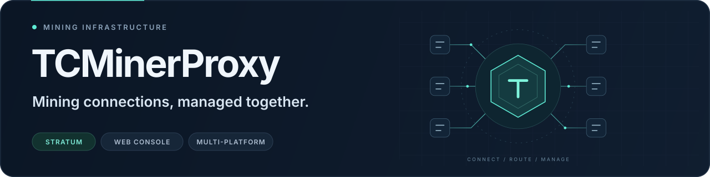
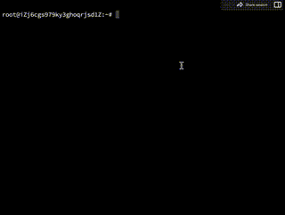

<div align="center">

<p></p>

<h1>TCMinerProxy — MinerProxy for Mining Pools</h1>

<p><strong>Pool proxy · Hashrate monitoring · TMS encrypted transport</strong></p>

<p>
  <a href="../../../README.md">简体中文</a> &nbsp; / &nbsp;
  <strong>English</strong> &nbsp; / &nbsp;
  <a href="../zh-RU/README.md">Русский</a>
</p>

<p>
  <a href="https://github.com/MinerProxyPro/TCMinerProxy/releases"></a>
  <a href="../../../LICENSE"></a>
  
  <a href="https://t.me/tcminerproxy"></a>
  <a href="https://discord.gg/PCKrcNArBE"></a>
  <a href="https://x.com/tcminerproxy"></a>
  <a href="https://github.com/MinerProxyPro/TCMinerProxy"></a>
</p>

<p>
  <a href="#download-and-install"><strong>Download and install →</strong></a> &nbsp; · &nbsp;
  <a href="https://www.tcminerproxy.com/document/tcminerproxy/quick-start">Pool connection guide</a> &nbsp; · &nbsp;
  <a href="https://www.tcminerproxy.com">Website</a> &nbsp; · &nbsp;
  <a href="https://www.tcminerproxy.com/customized-version">Free customization</a>
</p>

</div>

**TCMinerProxy is a MinerProxy mining pool proxy and relay tool for miners and mining farms.** Use its web console to manage miner connections, proxy ports, custom hashrate fees and hashrate statistics. It supports Linux and Windows, and can work with the TMS local client when encrypted, compressed transport is needed.

This repository provides **TCMinerProxy downloads, installation instructions, supported algorithms and links to documentation**. For your first deployment, start with [download and installation](#download-and-install). Before choosing a setup, review the [deployment options](#deployment-options) and [software fees](#software-and-custom-fees).

---

<p align="center">
  <a href="#core-capabilities">Capabilities</a> &nbsp; / &nbsp;
  <a href="#deployment-options">Deployment</a> &nbsp; / &nbsp;
  <a href="#download-and-install">Installation</a> &nbsp; / &nbsp;
  <a href="#supported-algorithms-and-coins">Supported coins</a> &nbsp; / &nbsp;
  <a href="#software-and-custom-fees">Fees</a> &nbsp; / &nbsp;
  <a href="#frequently-asked-questions">FAQ</a>
</p>

## Core capabilities

Use the server and TMS local client to suit your pool connections, traffic forwarding and day-to-day operations.

<table>
  <tr>
    <td width="50%" valign="top">
      <sub>01 / PROXY</sub>
      <h3>Pool proxy and relay</h3>
      <p>Connect to mainstream mining pools and centrally manage miner connections, port assignments and forwarding rules.</p>
    </td>
    <td width="50%" valign="top">
      <sub>02 / FORWARDING</sub>
      <h3>Transparent forwarding</h3>
      <p>TP mode forwards connections without coin parsing, statistics or fee processing.</p>
    </td>
  </tr>
  <tr>
    <td width="50%" valign="top">
      <sub>03 / FEE CONTROL</sub>
      <h3>Custom hashrate fees</h3>
      <p>Set the fee percentage to match the requirements of your operation.</p>
    </td>
    <td width="50%" valign="top">
      <sub>04 / TMS TRANSPORT</sub>
      <h3>Encryption and compression</h3>
      <p>Pair the server with the TMS local client to improve transport security and reduce bandwidth use.</p>
    </td>
  </tr>
  <tr>
    <td width="50%" valign="top">
      <sub>05 / DEPLOYMENT</sub>
      <h3>Multiple platforms</h3>
      <p>Support for Linux, Windows and ARM/ARMV7 devices, with installation scripts and program packages.</p>
    </td>
    <td width="50%" valign="top">
      <sub>06 / WEB CONSOLE</sub>
      <h3>Web management</h3>
      <p>View system status, ports, online miners and hashrate data in your browser.</p>
    </td>
  </tr>
</table>

## Web console preview

<p align="center">
  
</p>
<p align="center"><sub>Web console · Miner connections, operating status and hashrate monitoring</sub></p>

## Deployment options

| Your requirement | Components | Location and purpose |
| :--- | :--- | :--- |
| Connect to an existing third-party pool | **TCMinerProxy server** | Runs on a proxy server or farm gateway and manages ports, miner connections, fee wallets and statistics. |
| Encrypt and compress the farm's connection | **TCMinerProxy + TMS** | TMS runs on the farm's local network and aggregates miner connections before connecting to the server. |

Standard pool proxy connection:

```text
Miners → TCMinerProxy server → Third-party pool
```

Connection with TMS:

```text
Miners → Local TMS client → TCMinerProxy server → Third-party pool
```

Configuration guides: [TCMinerProxy server documentation](https://www.tcminerproxy.com/document/tcminerproxy) · [TMS encryption and compression](https://www.tcminerproxy.com/document/tms).

## Download and install

| Deployment | Environment | Installation resources |
| :--- | :--- | :--- |
| **Linux** | Ubuntu 20.04 or later recommended | [Linux installation](#linux-installation) · [Linux binaries](https://github.com/MinerProxyPro/TCMinerProxy/tree/main/linux) |
| **Windows** | Windows devices | [Windows installation](#windows-installation) · [Windows binaries](https://github.com/MinerProxyPro/TCMinerProxy/tree/main/windows) |
| **TMS client** | Connections requiring encryption and compression | [TMS project and instructions](https://github.com/MinerProxyPro/TMS) |

Check the [version tags](https://github.com/MinerProxyPro/TCMinerProxy/tags) and [official server download page](https://www.tcminerproxy.com/download/tcminerproxy-core-server) to select a program for your environment. Refer to the official release for version numbers and filenames.

> [!IMPORTANT]
> Default username: `qzpm19kkx` · Default password: `xloqslz913`.<br>
> After your first login, change the username, password and web access port, set a secure access URL and enable two-factor authentication. If installation prompts you to create your own credentials, follow those prompts. Read the [service agreement](#service-agreement) before use.

### Linux installation

**1. Open the installation tool**

With root privileges, run the following in Bash with curl installed:

```sh
bash <(curl -s -L https://github.com/MinerProxyPro/TCMinerProxy/raw/main/install.sh)
```

**Alternative installation URL (use if GitHub access is slow)**

```sh
bash <(curl -s -L -k https://cdn.tcminerproxy.com/MinerProxyPro/TCMinerProxy/raw/main/install.sh)
```

**2. Follow the installation menu**

The tool provides installation, updates, start/stop controls, port changes and startup configuration.

<details>
<summary>View the installation menu demonstration</summary>

<p align="center">
  
</p>

</details>

**3. Open the management console**

Open the address shown in the terminal in your browser, sign in and configure your credentials and ports. For manual deployment and startup checks, see the [Linux and Windows installation guide](https://www.tcminerproxy.com/document/tcminerproxy/installation).

### Windows installation

1. Open the [Windows download directory](https://github.com/MinerProxyPro/TCMinerProxy/tree/main/windows) and select the latest `TCMinerProxy-*.exe`.
2. Open its file page and click **View raw** to download it.
3. Run the program and open the management console address shown in the terminal.
4. Sign in with the default credentials, then change the username, password and web access port.

### Connect your first miners

Start with **1–5 test miners** to verify the complete connection path before expanding the deployment.

1. Prepare the upstream pool address, protocol, wallet or subaccount, and worker name.
2. In the console, open **Mining pool proxy → Create new proxy** and specify the listening protocol, port and coin.
3. Configure the main pool address and protocol, adding a backup pool and fee wallets as needed. Make sure miners can reach the listening port and the server can reach the upstream pool.
4. Save the configuration, wait for the port to become healthy, and connect your test miners to the server's listening address.
5. Check online devices, hashrate and connection logs in the console, and verify worker data at the upstream pool.

For example, a TCP listening port uses this miner connection address format:

```text
stratum+tcp://YOUR_SERVER_IP:LISTENING_PORT
```

For protocol selection and detailed configuration, see the [pool proxy quick start](https://www.tcminerproxy.com/document/tcminerproxy/quick-start) and [proxy port creation guide](https://www.tcminerproxy.com/document/tcminerproxy/proxy-port).

## Supported algorithms and coins

<p>
   &nbsp;
   &nbsp;
   &nbsp;
   &nbsp;
   &nbsp;
   &nbsp;
   &nbsp;
   &nbsp;
   &nbsp;
   &nbsp;
  
</p>

The project documentation lists BTC, BCH, LTC, ETC, ETHW, KASPA and other coins with their algorithms. **Algorithm support and compatibility with specific miners and pools must be checked separately.** Actual support depends on the installed version, miner protocol and pool requirements.

<details>
<summary><strong>Show the complete algorithm and coin list</strong></summary>

| Algorithm | Supported coins |
| :--- | :--- |
| SHA256 | BTC, BCH, SPACE |
| ETHASH | ETC, ETHW, ETHF, OCTA, ETC+ZIL, ETHW+ZIL, ETHF+ZIL, CLORE, NEURAI, NEOXA, ZIL, CLO, UBQ, EGAZ, ELH, AVS, CAU, PAC, PWR, BTN, DUBX, XPB, REDEV2, RTH, DOGETHER |
| SCRYPT | LTC, BEL |
| KHEAVYHASH | KASPA, PYI, SDR |
| KARLSENHASH | KLS |
| BLAKE2S | KDA |
| BLAKE2B | SC, HNS |
| OCTOPUS | CFX |
| DYNEXSOLVE | DNX |
| EAGLESONG | CKB |
| EQUIHASH | ZEN, ZEC |
| LBRY | LBC |
| X11 | DASH, BLOCX |
| PROGPOW | SERO |
| BLAKE3 | ALPH, IRON |
| RANDOMX | XMR, ZEPH, NEVO |
| KAWPOW | RVN, MEWC, AIPG |
| SHA512256D | RXD |
| AUTOYKOS2 | ERG |
| NEXAPOW | NEXA |
| GHOSTRIDER | RTM, RTC, MECU, MAXE, NIKI, SUBI, NEVO |
| CUCKATOO32 | GRIN |

</details>

## Software and custom fees

Distinguish the software service fee from the operator's custom hashrate fee:

| Fee | Published information | Application |
| :--- | :--- | :--- |
| **Pool proxy software fee** | **0.2%** of connected hashrate | Third-party pool proxy deployments. |
| **Custom hashrate fee** | Configured by the operator | Defined through fee wallets, worker names, percentages and target pools. |

Software fee information is based on the [official fee page](https://www.tcminerproxy.com/about), reviewed on 2026-10-08. Check the current console, release notes and service agreement for the applicable rules. Setting an operator fee does not replace checking the software fee.

## Frequently asked questions

### How do TCMinerProxy and TMS differ?

TCMinerProxy is the server and manages pool proxy connections, ports, fee wallets and operating statistics. TMS is the farm's local client and aggregates miner connections while providing encrypted, compressed transport. Use them together for TMS access; miners can also connect directly to a compatible server proxy port. See the [TMS deployment documentation](https://www.tcminerproxy.com/document/tms).

### How does transparent forwarding differ from a pool proxy?

The official quick start describes **TP transparent forwarding** as connection forwarding without coin parsing, statistics or fee processing. Use an appropriate pool proxy protocol when you need coin statistics and fee wallets. Review the [listening protocol guide](https://www.tcminerproxy.com/document/tcminerproxy/quick-start) before deployment.

### How many miners can one server handle?

Capacity depends on CPU, memory, bandwidth, coin protocols, connection count and compression settings. The software name alone does not determine capacity. The official quick start recommends testing with 1–5 miners first, then assessing expansion using CPU, memory, network, latency and connection logs.

### Why can I open the console but not connect miners?

Check the miner address and listening port, server firewall and cloud security group, protocol compatibility, and connectivity from the server to the upstream pool. Then review the connection logs in the port details. See [troubleshooting miner connection failures](https://www.tcminerproxy.com/document/tcminerproxy/miner-cannot-connect-port).

### Where can I download and update the MinerProxy server?

This project's server is named **TCMinerProxy**. Download it from this repository's [Linux directory](https://github.com/MinerProxyPro/TCMinerProxy/tree/main/linux), [Windows directory](https://github.com/MinerProxyPro/TCMinerProxy/tree/main/windows) or [official download page](https://www.tcminerproxy.com/download/tcminerproxy-core-server). The Linux installation tool provides an update option. Back up your configuration and check the target version before updating.

## Documentation and support

| I want to… | Start here |
| :--- | :--- |
| Download and install the server | [Linux and Windows installation](https://www.tcminerproxy.com/document/tcminerproxy/installation) |
| Connect to a pool and configure the proxy | [Pool proxy quick start](https://www.tcminerproxy.com/document/tcminerproxy/quick-start) |
| Configure encrypted, compressed transport | [TMS local client documentation](https://www.tcminerproxy.com/document/tms) |
| Secure console access | [Account, port and security settings](https://www.tcminerproxy.com/document/tcminerproxy/security) |
| Read the full instructions | [Documentation center](https://www.tcminerproxy.com/document/tcminerproxy) |
| Get a customized version | [Free customization](https://www.tcminerproxy.com/customized-version) |
| Contact the project and review its terms | [Contact and service agreement](https://www.tcminerproxy.com/about) |

### Community

Get project updates, discuss deployment issues or ask about customized versions:

<p>
  <a href="https://t.me/tcminerproxy"></a>
  <a href="https://discord.gg/PCKrcNArBE"></a>
  <a href="https://x.com/tcminerproxy"></a>
  <a href="https://github.com/MinerProxyPro/TCMinerProxy/releases"></a>
</p>

### Acknowledgements

Thanks to the following mining pools for providing technical support in certain areas:

<table>
  <tr>
    <td align="center" width="160"></td>
    <td align="center" width="160"></td>
    <td align="center" width="160"></td>
    <td align="center" width="160"></td>
  </tr>
</table>

## Service agreement

> [!CAUTION]
> TCMinerProxy is subject to Hong Kong law. Laws in different countries or regions may restrict products and services of this type. Before use, confirm that cryptocurrency, miner management and mining pool services are permitted in your jurisdiction.

<details>
<summary><strong>Read the complete service agreement</strong></summary>

#### Legal compliance

TCMinerProxy is governed by Hong Kong law. Countries and regions regulate cryptocurrency, miner operations and mining pool proxy services differently. Before use, verify that the relevant activities are permitted locally.

#### Nature of the product

This software is not a VPN tool and cannot provide cross-border access to restricted network resources.

It is a miner and mining farm management tool and does not unlawfully collect miner data. Device owners must actively configure the connection addresses of all participating miners, and users must be fully informed.

#### User eligibility

By using this service, you confirm that all of the following conditions apply:

1. You are not included in lists of terrorist organizations or individuals designated by the United Nations Security Council.
2. No law enforcement authority has restricted or prohibited your use of this software.
3. You are not a resident of Cuba, Iran, North Korea, Syria or any jurisdiction subject to international sanctions.
4. You are not a resident of a jurisdiction whose laws prohibit cryptocurrency-related activities, including mainland China.
5. The laws of your jurisdiction fully permit your use of all software functions.

#### Allocation of responsibility

1. If using the software violates applicable laws or policies in your jurisdiction, you alone bear all resulting legal consequences and risks.
2. You voluntarily, unconditionally and irrevocably waive all rights to hold the project responsible or seek compensation from it.
3. Downloading or running the software signifies that you have fully read and accepted these compliance terms. You bear responsibility for all related legal disputes.

</details>

## License

This project is published under the [MIT License](../../../LICENSE).

---

<p align="center">
  <strong>TCMinerProxy</strong><br>
  <sub>Mining connections, managed together.</sub><br><br>
  <a href="https://www.tcminerproxy.com">Website</a> &nbsp; · &nbsp;
  <a href="https://www.tcminerproxy.com/document/tcminerproxy">Documentation</a> &nbsp; · &nbsp;
  <a href="https://github.com/MinerProxyPro/TMS">TMS client</a> &nbsp; · &nbsp;
  <a href="#core-capabilities">Back to capabilities ↑</a>
</p>
