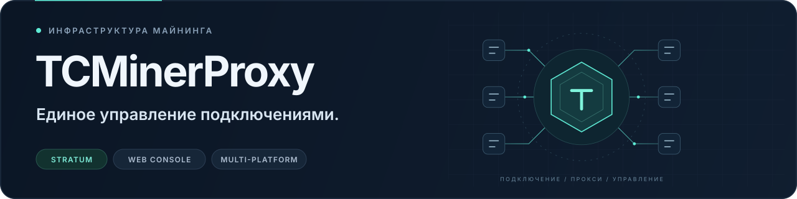

<div align="center">

<p></p>

<h1>TCMinerProxy — MinerProxy для майнинг-пулов</h1>

<p><strong>Прокси пулов · Мониторинг хешрейта · Шифрование TMS</strong></p>

<p>
  <a href="../../../README.md">简体中文</a> &nbsp; / &nbsp;
  <a href="../zh-EN/README.md">English</a> &nbsp; / &nbsp;
  <strong>Русский</strong>
</p>

<p>
  <a href="https://github.com/MinerProxyPro/TCMinerProxy/releases"></a>
  <a href="../../../LICENSE"></a>
  
  <a href="https://t.me/tcminerproxy"></a>
  <a href="https://discord.gg/PCKrcNArBE"></a>
  <a href="https://x.com/tcminerproxy"></a>
  <a href="https://github.com/MinerProxyPro/TCMinerProxy"></a>
</p>

<p>
  <a href="#скачивание-и-установка"><strong>Скачать и установить →</strong></a> &nbsp; · &nbsp;
  <a href="https://www.tcminerproxy.com/ru/document/tcminerproxy/quick-start">Подключение к пулу</a> &nbsp; · &nbsp;
  <a href="https://www.tcminerproxy.com/ru">Сайт</a> &nbsp; · &nbsp;
  <a href="https://www.tcminerproxy.com/ru/customized-version">Бесплатная настройка под заказ</a>
</p>

</div>

**TCMinerProxy — инструмент MinerProxy для проксирования и ретрансляции соединений майнеров и майнинг-ферм.** Веб-панель позволяет управлять подключениями, портами прокси, настраиваемыми комиссиями и статистикой хешрейта. Поддерживаются Linux и Windows. Для шифрования и сжатия трафика можно подключить локальный клиент TMS.

В репозитории доступны **загрузки TCMinerProxy, инструкции по установке, список алгоритмов и ссылки на документацию**. При первом развёртывании начните со [скачивания и установки](#скачивание-и-установка). Перед выбором конфигурации ознакомьтесь с [вариантами развёртывания](#варианты-развёртывания) и [комиссиями](#комиссии-программы-и-оператора).

---

<p align="center">
  <a href="#основные-возможности">Возможности</a> &nbsp; / &nbsp;
  <a href="#варианты-развёртывания">Развёртывание</a> &nbsp; / &nbsp;
  <a href="#скачивание-и-установка">Установка</a> &nbsp; / &nbsp;
  <a href="#поддерживаемые-алгоритмы-и-монеты">Монеты</a> &nbsp; / &nbsp;
  <a href="#комиссии-программы-и-оператора">Комиссии</a> &nbsp; / &nbsp;
  <a href="#частые-вопросы">Вопросы</a>
</p>

## Основные возможности

Используйте сервер и локальный клиент TMS в зависимости от задач подключения к пулам, передачи трафика и повседневного администрирования.

<table>
  <tr>
    <td width="50%" valign="top">
      <sub>01 / ПРОКСИ</sub>
      <h3>Прокси майнинг-пулов</h3>
      <p>Подключайтесь к популярным пулам и централизованно управляйте соединениями майнеров, портами и правилами передачи трафика.</p>
    </td>
    <td width="50%" valign="top">
      <sub>02 / РЕТРАНСЛЯЦИЯ</sub>
      <h3>Прозрачная передача</h3>
      <p>Режим TP передаёт соединения без анализа монет, сбора статистики и обработки комиссий.</p>
    </td>
  </tr>
  <tr>
    <td width="50%" valign="top">
      <sub>03 / КОМИССИИ</sub>
      <h3>Настраиваемая комиссия</h3>
      <p>Задавайте процент отчисления хешрейта с учётом условий эксплуатации.</p>
    </td>
    <td width="50%" valign="top">
      <sub>04 / КЛИЕНТ TMS</sub>
      <h3>Шифрование и сжатие</h3>
      <p>Используйте локальный клиент TMS для защиты соединений и снижения расхода пропускной способности.</p>
    </td>
  </tr>
  <tr>
    <td width="50%" valign="top">
      <sub>05 / ПЛАТФОРМЫ</sub>
      <h3>Разные платформы</h3>
      <p>Поддерживаются Linux, Windows и устройства ARM/ARMV7. Доступны установочные скрипты и пакеты программы.</p>
    </td>
    <td width="50%" valign="top">
      <sub>06 / ВЕБ-ПАНЕЛЬ</sub>
      <h3>Управление в браузере</h3>
      <p>Просматривайте состояние системы, порты, подключённые майнеры и данные хешрейта.</p>
    </td>
  </tr>
</table>

## Обзор веб-панели

<p align="center">
  
</p>
<p align="center"><sub>Веб-панель · Подключение майнеров, состояние системы и мониторинг хешрейта</sub></p>

## Варианты развёртывания

| Задача | Компоненты | Размещение и назначение |
| :--- | :--- | :--- |
| Подключение к стороннему пулу | **Сервер TCMinerProxy** | Работает на прокси-сервере или шлюзе фермы; управляет портами, подключениями, кошельками комиссий и статистикой. |
| Шифрование и сжатие соединения фермы | **TCMinerProxy + TMS** | TMS работает в локальной сети фермы и объединяет подключения майнеров перед передачей на сервер. |

Обычное подключение через прокси:

```text
Майнеры → Сервер TCMinerProxy → Сторонний пул
```

Подключение с TMS:

```text
Майнеры → Локальный TMS → Сервер TCMinerProxy → Сторонний пул
```

Руководства: [документация сервера TCMinerProxy](https://www.tcminerproxy.com/ru/document/tcminerproxy) · [шифрование и сжатие TMS](https://www.tcminerproxy.com/ru/document/tms).

## Скачивание и установка

| Вариант | Среда | Материалы для установки |
| :--- | :--- | :--- |
| **Linux** | Рекомендуется Ubuntu 20.04 или новее | [Установка в Linux](#установка-в-linux) · [Файлы для Linux](https://github.com/MinerProxyPro/TCMinerProxy/tree/main/linux) |
| **Windows** | Устройства Windows | [Установка в Windows](#установка-в-windows) · [Файлы для Windows](https://github.com/MinerProxyPro/TCMinerProxy/tree/main/windows) |
| **Клиент TMS** | Соединения с шифрованием и сжатием | [Проект TMS и инструкции](https://github.com/MinerProxyPro/TMS) |

Сверьтесь с [тегами версий](https://github.com/MinerProxyPro/TCMinerProxy/tags) и [официальной страницей загрузки сервера](https://www.tcminerproxy.com/ru/download/tcminerproxy-core-server), чтобы выбрать программу для своей среды. Версии и имена файлов определяются официальными публикациями.

> [!IMPORTANT]
> Стандартный логин: `qzpm19kkx` · Пароль: `xloqslz913`.<br>
> После первого входа измените логин, пароль и порт веб-доступа, задайте защищённый адрес входа и включите двухфакторную аутентификацию. Если установщик предлагает создать собственные учётные данные, следуйте его указаниям. Перед использованием прочитайте [пользовательское соглашение](#пользовательское-соглашение).

### Установка в Linux

**1. Запустите инструмент установки**

Выполните команду в Bash с правами root и установленным curl:

```sh
bash <(curl -s -L https://github.com/MinerProxyPro/TCMinerProxy/raw/main/install.sh)
```

**Альтернативный адрес установки (если GitHub работает медленно)**

```sh
bash <(curl -s -L -k https://cdn.tcminerproxy.com/MinerProxyPro/TCMinerProxy/raw/main/install.sh)
```

**2. Следуйте пунктам меню**

Инструмент поддерживает установку, обновление, запуск, остановку, изменение портов и настройку автозапуска.

<details>
<summary>Посмотреть демонстрацию меню установки</summary>

<p align="center">
  
</p>

</details>

**3. Откройте панель управления**

Откройте в браузере адрес из терминала, войдите в панель и настройте учётные данные и порты. Ручное развёртывание и проверка запуска описаны в [руководстве по установке в Linux и Windows](https://www.tcminerproxy.com/ru/document/tcminerproxy/installation).

### Установка в Windows

1. Откройте [каталог загрузок для Windows](https://github.com/MinerProxyPro/TCMinerProxy/tree/main/windows) и выберите последнюю версию `TCMinerProxy-*.exe`.
2. На странице файла нажмите **View raw**, чтобы скачать его.
3. Запустите программу и откройте в браузере адрес панели, указанный в терминале.
4. Войдите со стандартными учётными данными, затем измените логин, пароль и порт веб-доступа.

### Подключение первых майнеров

Начните с **1–5 тестовых майнеров**, чтобы проверить всю цепочку соединения перед расширением системы.

1. Подготовьте адрес и протокол вышестоящего пула, кошелёк или субаккаунт, а также имя воркера.
2. В панели откройте **Прокси майнинг-пула → Создать новый прокси** и укажите протокол прослушивания, порт и монету.
3. Настройте адрес и протокол основного пула; при необходимости добавьте резервный пул и кошельки комиссий. Убедитесь, что майнеры могут подключаться к порту, а сервер — к вышестоящему пулу.
4. Сохраните настройки, дождитесь нормального состояния порта и подключите тестовые майнеры к адресу прослушивания сервера.
5. Проверьте подключённые устройства, хешрейт и журналы соединений в панели, а также данные воркеров на стороне пула.

Например, для порта с протоколом TCP адрес подключения имеет вид:

```text
stratum+tcp://IP_ВАШЕГО_СЕРВЕРА:ПОРТ_ПРОСЛУШИВАНИЯ
```

Выбор протокола и подробные настройки описаны в [руководстве по быстрому запуску прокси](https://www.tcminerproxy.com/ru/document/tcminerproxy/quick-start) и [инструкции по созданию порта](https://www.tcminerproxy.com/ru/document/tcminerproxy/proxy-port).

## Поддерживаемые алгоритмы и монеты

<p>
   &nbsp;
   &nbsp;
   &nbsp;
   &nbsp;
   &nbsp;
   &nbsp;
   &nbsp;
   &nbsp;
   &nbsp;
   &nbsp;
  
</p>

В документации перечислены BTC, BCH, LTC, ETC, ETHW, KASPA и другие монеты с соответствующими алгоритмами. **Поддержку алгоритма и совместимость с конкретными майнерами и пулами необходимо проверять отдельно.** Фактическая поддержка зависит от версии программы, протокола майнера и требований пула.

<details>
<summary><strong>Показать полный список алгоритмов и монет</strong></summary>

| Алгоритм | Поддерживаемые монеты |
| :--- | :--- |
| SHA256 | BTC, BCH, SPACE |
| ETHASH | ETC, ETHW, ETHF, OCTA, ETC+ZIL, ETHW+ZIL, ETHF+ZIL, CLORE, NEURAI, NEOXA, ZIL, CLO, UBQ, EGAZ, ELH, AVS, CAU, PAC, PWR, BTN, DUBX, XPB, REDEV2, RTH, DOGETHER |
| SCRYPT | LTC, BEL |
| KHEAVYHASH | KASPA, PYI, SDR |
| KARLSENHASH | KLS |
| BLAKE2S | KDA |
| BLAKE2B | SC, HNS |
| OCTOPUS | CFX |
| DYNEXSOLVE | DNX |
| EAGLESONG | CKB |
| EQUIHASH | ZEN, ZEC |
| LBRY | LBC |
| X11 | DASH, BLOCX |
| PROGPOW | SERO |
| BLAKE3 | ALPH, IRON |
| RANDOMX | XMR, ZEPH, NEVO |
| KAWPOW | RVN, MEWC, AIPG |
| SHA512256D | RXD |
| AUTOYKOS2 | ERG |
| NEXAPOW | NEXA |
| GHOSTRIDER | RTM, RTC, MECU, MAXE, NIKI, SUBI, NEVO |
| CUCKATOO32 | GRIN |

</details>

## Комиссии программы и оператора

Комиссию за использование программы и комиссию, заданную оператором, следует рассматривать отдельно:

| Комиссия | Опубликованные условия | Применение |
| :--- | :--- | :--- |
| **Комиссия программы за прокси пулов** | **0.2%** от подключённого хешрейта | Проксирование сторонних майнинг-пулов. |
| **Комиссия оператора** | Настраивается оператором | Задаётся через кошельки комиссий, имена воркеров, процент и целевой пул. |

Данные о комиссии программы взяты с [официальной страницы](https://www.tcminerproxy.com/ru/about) и проверены 2026-10-08. Действующие правила уточняйте в панели текущей версии, примечаниях к выпуску и пользовательском соглашении. Настройка комиссии оператора не заменяет проверку комиссии программы.

## Частые вопросы

### Чем отличаются TCMinerProxy и TMS?

TCMinerProxy — сервер, который управляет прокси-соединениями, портами, кошельками комиссий и статистикой. TMS — локальный клиент фермы: он объединяет подключения майнеров, шифрует и сжимает трафик. Для подключения через TMS нужны оба компонента; майнеры также могут подключаться напрямую к совместимому прокси-порту сервера. Подробнее — в [документации TMS](https://www.tcminerproxy.com/ru/document/tms).

### Чем прозрачная передача отличается от обычного прокси пула?

В официальном руководстве режим **TP** описан как передача соединений без анализа монет, статистики и обработки комиссий. Для статистики по монетам и настройки кошельков комиссий используйте соответствующий протокол прокси пула. Перед развёртыванием ознакомьтесь с [описанием протоколов прослушивания](https://www.tcminerproxy.com/ru/document/tcminerproxy/quick-start).

### Сколько майнеров может обслуживать один сервер?

Ёмкость зависит от процессора, памяти, пропускной способности, протоколов монет, числа соединений и настроек сжатия. Определить её только по названию программы нельзя. Официальное руководство рекомендует сначала проверить подключение 1–5 майнеров, а затем оценивать расширение по загрузке CPU, памяти и сети, задержкам и журналам соединений.

### Почему панель открывается, а майнеры не подключаются?

Проверьте адрес майнера и порт прослушивания, межсетевой экран сервера и группу безопасности облака, совместимость протоколов, а также доступность вышестоящего пула с сервера. Затем изучите журналы в деталях порта. Порядок действий приведён в разделе [«Майнер не подключается к порту»](https://www.tcminerproxy.com/ru/document/tcminerproxy/miner-cannot-connect-port).

### Где скачать и обновить сервер MinerProxy?

Сервер этого проекта называется **TCMinerProxy**. Скачать его можно из [каталога Linux](https://github.com/MinerProxyPro/TCMinerProxy/tree/main/linux), [каталога Windows](https://github.com/MinerProxyPro/TCMinerProxy/tree/main/windows) или с [официальной страницы загрузки](https://www.tcminerproxy.com/ru/download/tcminerproxy-core-server). В установочном инструменте Linux есть пункт обновления. Перед обновлением сохраните резервную копию конфигурации и проверьте целевую версию.

## Документация и поддержка

| Задача | С чего начать |
| :--- | :--- |
| Скачать и установить сервер | [Установка в Linux и Windows](https://www.tcminerproxy.com/ru/document/tcminerproxy/installation) |
| Подключиться к пулу и настроить прокси | [Быстрый запуск прокси](https://www.tcminerproxy.com/ru/document/tcminerproxy/quick-start) |
| Настроить шифрование и сжатие | [Документация локального клиента TMS](https://www.tcminerproxy.com/ru/document/tms) |
| Защитить доступ к панели | [Учётные данные, порты и безопасность](https://www.tcminerproxy.com/ru/document/tcminerproxy/security) |
| Прочитать полное руководство | [Центр документации](https://www.tcminerproxy.com/ru/document/tcminerproxy) |
| Получить версию под свои задачи | [Бесплатная настройка под заказ](https://www.tcminerproxy.com/ru/customized-version) |
| Связаться с проектом и изучить условия | [Контакты и пользовательское соглашение](https://www.tcminerproxy.com/ru/about) |

### Сообщество

Следите за обновлениями, обсуждайте вопросы развёртывания и запрашивайте настройку под свои задачи:

<p>
  <a href="https://t.me/tcminerproxy"></a>
  <a href="https://discord.gg/PCKrcNArBE"></a>
  <a href="https://x.com/tcminerproxy"></a>
  <a href="https://github.com/MinerProxyPro/TCMinerProxy/releases"></a>
</p>

### Благодарности

Благодарим следующие майнинг-пулы за техническую поддержку по отдельным вопросам:

<table>
  <tr>
    <td align="center" width="160"></td>
    <td align="center" width="160"></td>
    <td align="center" width="160"></td>
    <td align="center" width="160"></td>
  </tr>
</table>

## Пользовательское соглашение

> [!CAUTION]
> TCMinerProxy регулируется законодательством Гонконга. Законы разных стран и регионов могут ограничивать подобные продукты и услуги. Перед использованием убедитесь, что в вашей юрисдикции разрешена деятельность, связанная с криптовалютами, управлением майнерами и майнинг-пулами.

<details>
<summary><strong>Прочитать полное пользовательское соглашение</strong></summary>

#### Соблюдение законодательства

TCMinerProxy подчиняется законодательству Гонконга. Страны и регионы по-разному регулируют криптовалюты, эксплуатацию майнеров и прокси-сервисы майнинг-пулов. Перед использованием самостоятельно проверьте, разрешена ли соответствующая деятельность в вашей юрисдикции.

#### Назначение продукта

Программа не является VPN-инструментом и не предоставляет трансграничный доступ к ограниченным сетевым ресурсам.

Это инструмент управления майнерами и майнинг-фермами; он не собирает данные майнеров незаконным способом. Владельцы всех подключаемых устройств должны самостоятельно настроить адрес подключения, а пользователи должны быть полностью информированы.

#### Требования к пользователям

Используя сервис, вы подтверждаете соответствие всем следующим условиям:

1. Вы не включены в списки террористических организаций или лиц, определённые Советом Безопасности ООН.
2. Правоохранительные органы не ограничивали и не запрещали вам использование этой программы.
3. Вы не являетесь резидентом Кубы, Ирана, Северной Кореи, Сирии или юрисдикций, находящихся под международными санкциями.
4. Вы не являетесь резидентом территории, где законодательство запрещает деятельность, связанную с криптовалютами, включая материковый Китай.
5. Законы вашей юрисдикции полностью разрешают вам использовать все функции программы.

#### Распределение ответственности

1. Если использование программы нарушает законы или правила вашей юрисдикции, все соответствующие правовые последствия и риски несёте только вы.
2. Вы добровольно, безусловно и безотзывно отказываетесь от права привлекать проект к ответственности и требовать от него компенсацию.
3. Скачивание или запуск программы означает, что вы полностью прочитали и приняли эти условия. Ответственность за все связанные правовые споры несёте вы.

</details>

## Лицензия

Проект распространяется по [лицензии MIT](../../../LICENSE).

---

<p align="center">
  <strong>TCMinerProxy</strong><br>
  <sub>Единое управление подключениями.</sub><br><br>
  <a href="https://www.tcminerproxy.com/ru">Сайт</a> &nbsp; · &nbsp;
  <a href="https://www.tcminerproxy.com/ru/document/tcminerproxy">Документация</a> &nbsp; · &nbsp;
  <a href="https://github.com/MinerProxyPro/TMS">Клиент TMS</a> &nbsp; · &nbsp;
  <a href="#основные-возможности">К возможностям ↑</a>
</p>
